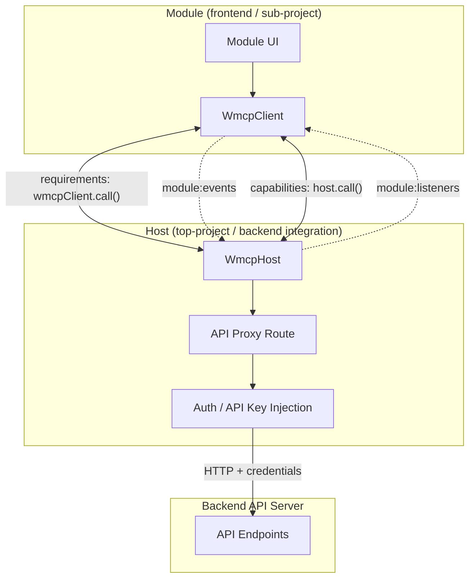
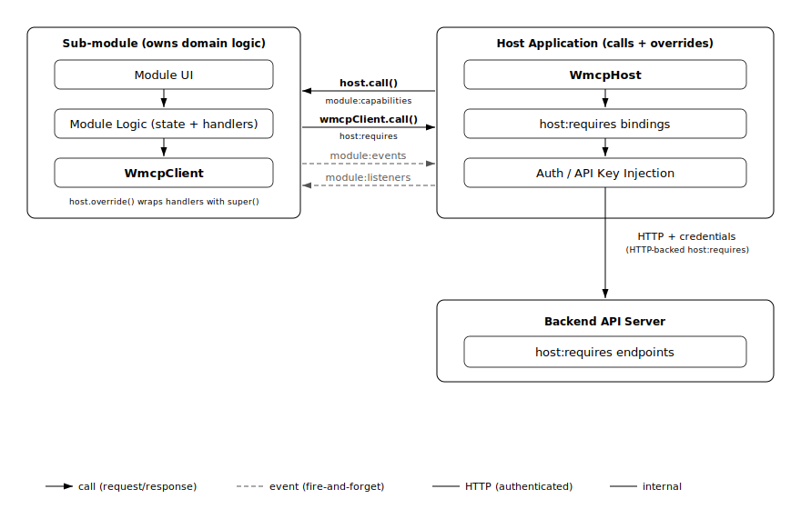
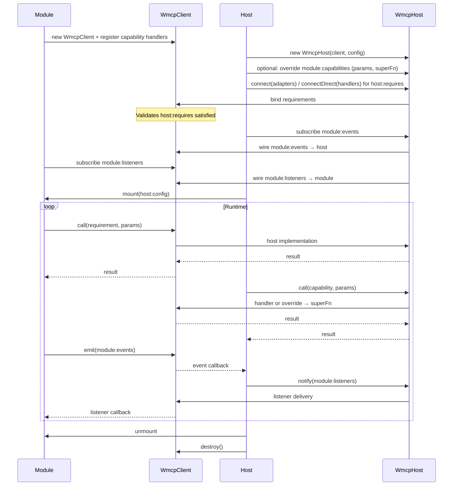
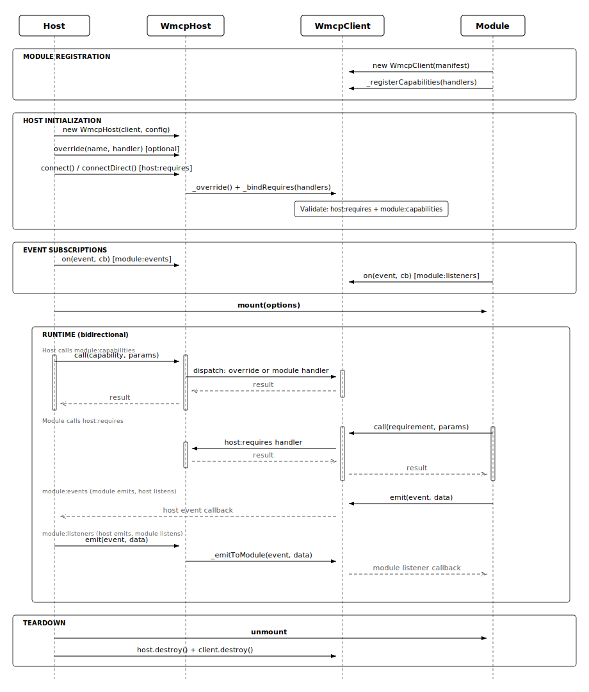

# wMCP Core Concepts

Web Module Connection Protocol (wMCP) defines how host applications integrate framework-agnostic UI modules with backend services in a consistent, secure, and machine-readable way. The protocol is **bidirectional**: the module exposes overridable domain logic, and the host supplies backend access and cross-cutting behavior. This document states the problem, architecture, manifest sections, abstractions, lifecycle, design principles, and transport modes.

---

## 1. Problem Statement

Modern web applications are increasingly assembled from independent feature modules: rich text editors, dashboards, file managers, media players, and similar units of functionality. Each module may need to reach backend APIs, and hosts often need to **call into** or **wrap** module behavior without forking the module. Several constraints make ad-hoc integration painful:

- **Composition**: Teams ship and reuse modules across products. Without a shared contract, every integration invents its own props, callbacks, and fetch patterns.
- **Security**: Modules should not hold API keys, session tokens, or OAuth secrets. Those belong in the host, which already participates in authentication and policy.
- **Framework neutrality**: A reusable module should not depend on React, Vue, Svelte, or Angular in its public protocol surface. The same manifest and client API should work regardless of how the UI is rendered.
- **Wiring cost**: Each module historically exposes a different shape of integration hooks. Host developers and tooling cannot assume a single pattern.
- **Extensibility**: Hosts need a first-class way to extend or replace module behavior (similar to overriding methods) while still delegating to defaults when appropriate.
- **Automation**: AI agents and code generators need a declarative, complete description of provided operations, required services, events, listeners, and configuration so they can scaffold host adapters and proxy routes reliably.

wMCP addresses this by standardizing a manifest-driven contract between a **module** (frontend sub-project: UI + `WmcpClient`, owns domain defaults), a **host** (top-project backend integration: `WmcpHost`, proxy, auth, overrides), and a **backend** (ordinary HTTP APIs). Traffic and notifications can flow **both ways** across the module–host boundary.

---

## 2. Architecture

wMCP uses a **three-layer model** with **bidirectional** arrows between module and host. The module provides **capabilities** the host can call and optionally override; the module **requires** services from the host for backend access. Events and listeners are symmetric: the module can notify the host, and the host can notify the module.

Think of the relationship by analogy: the **module** is like a **base class** (default domain behavior); the **host** is like a **derived class** (can call, extend, or replace that behavior while still invoking the original via a `super`-style hook).

### Module

The module bundles UI and domain defaults and ships a **manifest** with colon-keyed sections (see below). It registers **handlers** for **`module:capabilities`** (defaults the host may override). It invokes **`host:requires`** through **`wmcpClient.call()`** so it never holds host secrets. It **emits** **`module:events`** and **subscribes** to **`module:listeners`**. Optional **hints** on requirements suggest HTTP shapes; the host may ignore them.

### Host application

The host instantiates **`WmcpHost`**, optionally **overrides** module capabilities with wrappers that receive **`(params, superFn)`**, binds **`host:requires`** via **`connect()`** or **`connectDirect()`**, subscribes to **`module:events`**, and ensures the module receives **`module:listeners`** as needed. It attaches **auth** before traffic reaches the backend. The host calls into the module’s exposed capabilities via **`host.call()`** (in-process by default).

### Backend API

The backend exposes normal **HTTP endpoints**. It is unaware of wMCP. It receives authenticated requests and returns JSON, streams, or errors as usual.

---

## 3. Manifest sections (colon keys)

The manifest uses **literal colon-separated keys** for namespaces. Typical sections:

| Key | Direction | Meaning |
|-----|-----------|---------|
| **`module:capabilities`** | Module provides, host invokes | Named operations with **default implementations** on the module side. The host may **override** them. |
| **`module:events`** | Module → host | Notifications the module emits; the host subscribes. |
| **`module:listeners`** | Host → module | Notifications the host sends **into** the module; the module subscribes. |
| **`host:requires`** | Module needs from host | Operations satisfied by the host (HTTP adapters, in-process handlers, or mixed). The module calls them via **`wmcpClient.call()`**. |
| **`host:config`** | Host → module at mount | Mount-time configuration (theme, locale, flags, paths). Same conceptual role as before: typed or schema-constrained with defaults where optional. |

The manifest remains the **single source of truth** for the module’s external interface: documentation, runtime validation, and tooling should derive from it.

---

## 4. Key abstractions

### Capabilities (`module:capabilities`)

**Capabilities** are operations the **module provides** with **default implementations**. The host invokes them via **`host.call()`**. The host may **replace** a binding with a function **`(params, superFn) => result`** that can delegate to the module’s default (`superFn`), mirroring class inheritance with **`super()`**.

### Requirements (`host:requires`)

**Requirements** are operations the **module needs** from the host (backend access, platform APIs, policy). The module calls them via **`wmcpClient.call()`**. Like capabilities in the older one-way story, they support request/stream-style semantics where the manifest defines them; the host implements them at connect time.

### Events and listeners (bidirectional)

- **`module:events`**: **Outbound** from module to host. The module emits; the host listens (e.g. persistence, analytics, navigation).
- **`module:listeners`**: **Inbound** to the module from the host. The host notifies; the module subscribes.

Together they make **event traffic bidirectional** across the boundary, while keeping **RPC-style** traffic explicit on **`call`** APIs.

### Config (`host:config`)

**Config** is **mount-time** input from the host to the module. It should be typed or schema-constrained with defaults so mounting stays predictable and validatable.

### Hints

Entries under **`host:requires`** (and similar) may carry optional **hints**: suggested HTTP **method**, **path**, or related metadata. Hints are **advisory** and **non-authoritative**: the host may map a requirement to a different route, batch API, or in-process implementation. They improve ergonomics and **AI-friendly codegen** for proxies and adapters.

### Override (host wrapping module defaults)

An **override** is when the host **replaces** the module’s default capability implementation with a wrapper **`(params, superFn) => result`**, where **`superFn`** invokes the module’s registered default. This preserves a single declared name in **`module:capabilities`** while letting the host add logging, validation, alternate backends, or composition—analogous to **method override with `super()`** in object-oriented languages.

---

## 5. Lifecycle

The following sequence reflects **bidirectional** setup: client construction and capability registration on the module side, host construction, optional overrides, requirement binding, event/listener wiring, mount, runtime, and teardown.

### Phases

1. **Module constructs `WmcpClient` and registers capability handlers**  
   Defaults for **`module:capabilities`** live on the module side before the host overrides them.

2. **Host constructs `WmcpHost`**  
   The host holds references to the client and host-level configuration.

3. **Host optionally overrides `module:capabilities`**  
   Wrappers use **`(params, superFn)`** to extend or replace behavior while delegating to module defaults when desired.

4. **Host binds `host:requires`**  
   Via **`connect()`** (HTTP adapters, possibly mixed) or **`connectDirect()`** (in-process handlers). Bind-time validation ensures required services are present before runtime.

5. **Host subscribes to `module:events`; module subscribes to `module:listeners`**  
   Both directions of the event channel are explicitly wired.

6. **Mount**  
   The host mounts the module UI, passing **`host:config`** and any framework-specific props.

7. **Runtime**  
   Bidirectional **calls** (requirements vs. capabilities) and **events/listeners** run according to the manifest.

8. **Teardown**  
   On unmount, destroy the client, unsubscribe listeners, and cancel pending work to avoid leaks.

---

## 6. Override / inheritance mental model

- **`module:capabilities`** declare **names and contracts**; the module supplies **defaults**.
- The host **does not fork** the module to customize behavior: it **registers overrides** that wrap the default.
- **`superFn`** is the module’s implementation for that capability; the host’s override decides whether to call it, wrap its result, or short-circuit.
- This keeps **one manifest** and **one RPC surface** while allowing **top-project** policy and integration to sit **around** sub-project logic—structurally similar to **subclassing** without requiring the module to be a class literal in code.

---

## 7. Bidirectional events

| Manifest key | Producer | Consumer | Typical use |
|--------------|----------|----------|-------------|
| **`module:events`** | Module | Host | “Something changed in the module UI or state.” |
| **`module:listeners`** | Host | Module | “Host-driven updates”: route changes, feature flags, external data pushes. |

Events remain **notifications**, not a substitute for request/response **`call`** semantics, but **both directions** use the same idea: named channels, typed payloads where possible, and explicit subscription at integration time.

---

## 8. Design principles

These principles mirror the spirit of the Model Context Protocol (MCP) but target **web modules**, **hosts**, and **HTTP ecosystems** under a **bidirectional** contract.

1. **Framework-agnostic modules**  
   Modules MUST NOT depend on a specific UI framework in the protocol layer. No framework imports in the manifest contract or in `WmcpClient`’s public surface.

2. **Secrets stay in the host**  
   Auth material, API keys, and token refresh logic MUST NOT be embedded in or reachable from the module for **`host:requires`** implementations controlled by the host.

3. **Manifest as source of truth**  
   If a capability, requirement, event, listener, or config key is not declared under the appropriate colon-key section, it is not part of the supported interface.

4. **Validate at bind time**  
   Required **`host:requires`** entries MUST be satisfied when the host connects. Prefer loud failures at setup over silent `undefined` or late errors during user interaction.

5. **AI-friendly codegen**  
   Structured manifests plus **hints** on requirements enable agents to generate adapters, proxies, and types. Hints are optional but improve automation quality.

---

## 9. Transport modes

Transport is chosen **per boundary** and **per operation** where the API allows mixing.

### `host:requires`

- **`connectDirect`**: In-process **functions** in the same JavaScript runtime (e.g. server actions). No cross-runtime hop for those bindings.
- **`connect` with HTTP adapters**: Objects with **`resolve`** mapping to **`fetch`** (or server `fetch`) against same-origin or proxied URLs; **headers** static or per-request for credentials.
- **Mixed SSR / CSR**: A single **`connect()`** map may interleave direct handlers and HTTP adapters so some requirements run on the server and others in the browser, without the module knowing which is which.

### `module:capabilities`

- **In-process**: The host invokes module capability handlers **in-process** via **`host.call()`** (default integration for co-located host and module code).

### Streaming and future transports

- **SSE / streams**: For stream-shaped requirements or capabilities, implementations may use async iterables, SSE, or chunked HTTP as appropriate.
- **Future `postMessage`**: For iframe-isolated modules, serialized envelopes with origin checks may carry both **calls** and **events** across origins.
- **Future WebSocket**: Low-latency bidirectional channels could multiplex requirements, capabilities, **module:events**, and **module:listeners**.

Transport choice remains an implementation detail as long as the **manifest**, **bind-time validation**, and **security boundaries** are preserved.
